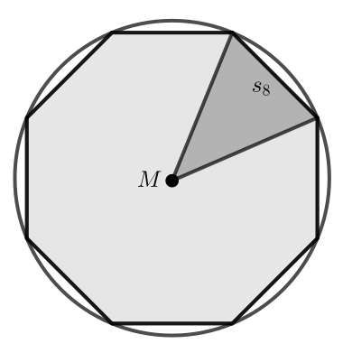

---
jupytext:
  cell_metadata_filter: -all
  formats: md:myst
  text_representation:
    extension: .md
    format_name: myst
    format_version: 0.13
    jupytext_version: 1.11.5
kernelspec:
  display_name: Python 3
  language: python
  name: python3
---

# Woche 2: Grundlagen der Numerik mit Python

Lernziele:

1. Ich kann die Auslöschung erklären.
2. Ich kann die Absorbtion erklären.
3. Ich kann `if` / `else` Blöcke nutzen.
4. Ich kann `for` und `while` Schleifen implementieren.

## Endliche Arithmetik

Die Ableitung einer stetig differenzierbaren Funktion $f$ an der Stelle $x_0$ ist definiert als

$$
f^\prime(x_0)= \lim\limits_{h\rightarrow 0} \frac{f(x_0+h)-f(x_0)}{h}.
$$

Für $f(x)=\tfrac{1}{2}x^2$ erhalten wir zum Beispiel $f^\prime(x)=x$.
Folgender Code appriximiert also für `h` nahe bei Null die Ableitung an der Stelle `x0`.
```{code-cell}
def derivative(g, x0, h):
  return (g(x0 + h) - g(x0)) / h

def f(x):
  return 0.5 * x**2

h_list = [10**(-4), 10**(-6), 10**(-8), 10**(-10), 10**(-12)]
for h in h_list:
  df = derivative(f, 1.0, h)
  print(df)
```

:::{admonition} Aufgabe
Was beobachten Sie im obigem Code? Finden Sie eine Erklärung.
:::

Archmides entwickelte einen Algorithmus zur Berechnung der Kreiszahl $\pi$.
Dabei approximiert er den Umfang des Einheitskreises (Radius 1),
welcher genau $2\pi$ entspricht.
Dem Kreis wird ein $n$-Eck einbeschrieben.
Sei $s_n$ dessen Seitenlänge.
Für die Seitenlänge $s_{2n}$ eines einbeschriebenen $2n$-Ecks
gilt dann die Rekursionsformel

$$
s_{2n}=\sqrt{2-2\sqrt{1-\frac{s_n^2}{4}}}
$$

Für das $4$-Eck gilt zum Beispiel $s_4=\sqrt{2}$.
Wir verzichten hier auf die (einfache) Herleitung dieser Formel.



```{code-cell}
import numpy as np

n = 4
s = np.sqrt(2.0)
for i in range(27):
  n = 2 * n
  s = np.sqrt(2.0 - 2.0 * np.sqrt(1.0 - 0.25 * s**2))
  pi_approx = 0.5 * n * s
  print(n, "\t", pi_approx)
```

Bezüglich $\pi=4$ gibt es einen fun-fact: [Indiana Pi Bill](https://de.wikipedia.org/wiki/Indiana_Pi_Bill)

Da $\pi$ eine irrationale Zahl ist, kann sie auch im Binärsystem nicht exakt dargestellt werden.
Auch die Zahl $0.1$ kann im Binärsystem nicht exakt dargestellt werden.

$$
0.1=\frac{1}{10}=\frac{1}{16}+\frac{1}{32}+\frac{1}{256}+\frac{1}{512}+\cdots
$$

Das heisst, die Darstellung dieser Zahl auf dem Computer ist immer fehlerbehaftet.
Gleitkommazahlen haben in der Nähe von Null die beste Auflösung.

```{image} images/gleitkommazahl.png
:alt: gleitkommazahl
:class: fig
:width: 600px
:align: center
```

```{image} images/exakt.png
:alt: exakt
:class: fig
:width: 600px
:align: center
```

:::{warning}
Seien $a$ und $b$ zwei Gleitkommazahlen, die aus.
- **Auslöschung:** Wenn $a$ und $b$ etwa gleich gross sind, dann kann das Resultat von $a-b$ einen grossen relativen Fehler haben.
- **Absorbtion:** Ist $a$ viel grösser ist $b$, so liegt das Ergebnis von $a+b$ zu nahe an $a$.
:::

Hier sind ein paar Beispiele.
```{code-cell}
def float_print(x):
  print("{0:0.20f}".format(x))

float_print(0.1)
float_print((1.0 / 3.0)**3 - 1 / 27)  # Auslöschung
float_print(1.0 + 1e-16)              # Absorbtion
```

Die Eigenschaften eines `numpy` floats kann man abfragen.
```{code-cell}
import numpy as np

np.finfo(float)
```


## Kontrollstrukturen

Letzte Woche haben wir folgendes Programm geschrieben.
Es gibt aus, ob die Zahl `n` gerade oer ungerade ist.
Hier bezeichnet `%` den Modulo-Operator (Rest aus Division).
```{code-cell}
n = 3

if n % 2 == 1:
  print(n, "ist gerade")
else:
  print(n, "ist ungerade")
```

:::{admonition} Aufgabe
Ergänzen Sie folgenden Python Code, so dass er die Binärdarstellung der natürlichen Zahl `n` ausgibt.
:::
```{code-cell}
# Zum Beispiel 6 --> 110 oder 26 --> 11010
n = 6

# Ihr Code kommt hier hin
# ...
# ...
```

:::{admonition} Aufgabe
Ergänzen Sie folgenden Python Code, so dass er die Quersumme der natürlichen Zahl `n` ausgibt.
:::
```{code-cell}
n = 43602299 # Quersumme ist 35

# Ihr Code kommt hier hin
# ...
# ...
```
